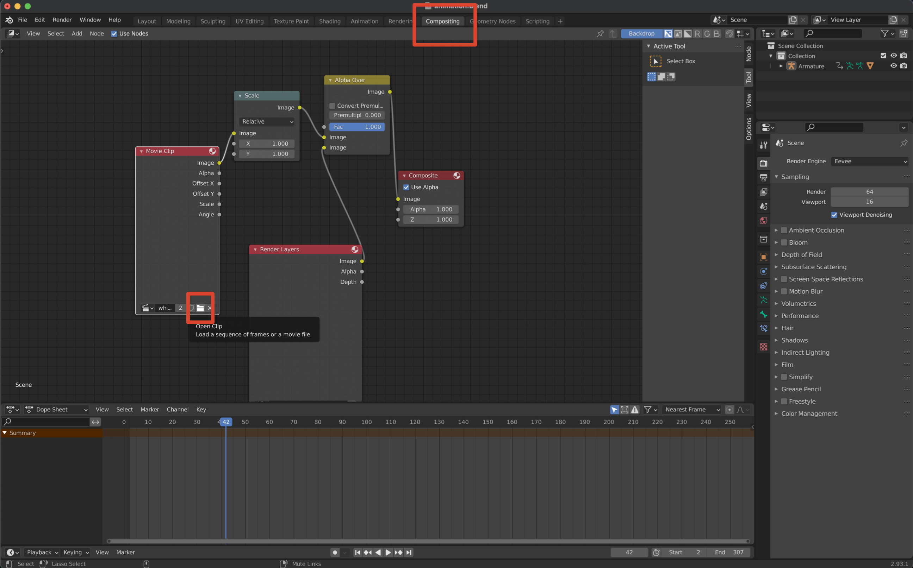

[English](README.md)｜[中](README.zh_CN.md)

# Blender addon for driving character

The addon drives a 3D cartoon character by transferring SMPL's pose and global translation into the skeleton of the 3D character. Poses and global translation can be obtained from RGB images using ROMP or any SMPL-based 3D pose estimation model. If the estimation model outputs pose and global position at a high speed, then you can achieve the effect of driving 3D characters in real time in Blender.

## Two Pipeline

### From Video to Animation

Example:

1. Modify the path of [demo1.npy](demo/demo1.npy) in [server.py](src/server.py) and start server.py on the CLI
2. Open [Beat.blend](Blender/Beta.blend) and click on the triangle in the upper right corner
   
3. Go back to the Layout view and click on the small icon in the upper right to get the Texture
     
4. Press Ctrl+E to run the addon. At this time, the keyframe that is being transferred is displayed in the command line running server.py
   
5. Press the space in Blender to view the character animation

> If you want to use your own video, you need to use [ROMP](https://github.com/Arthur151/ROMP)'s [video.sh](https://github.com/Arthur151/ROMP/blob/master/scripts/video.sh) to get a npz file.Then you need to adjust the data format in the npz file to match the [Data Format](#data-format).

### The Webcam Drive Character in Real-Time

Example:

1. Connect the camera and run ROMP's [webcam_blender.sh](https://github.com/Arthur151/ROMP/blob/master/scripts/webcam_blender.sh).
2. The rest of the steps are the same as steps 2, 3 of `From Video to Animation`, where the 3D characters in Blender are driven in real time by pressing Ctrl+E.

## Know-How

### Data Requester

The addon is a data requester that uses TCP to send data requests to `127.0.0.1:9999`. When the addon runs, it will continue to request data until the data sender either stops transferring or presses the A key in Blender.

### Data Sender

The data sender is bound to `127.0.0.1:9999` and will continuously send data to it after receiving requests from the data requester.

### Data Format

The data is a Python list of four elements in the form of `[mode,poses,global translation,current keyframe id]`.

1. Mode is an integer, 1 for insert keyframe, 0 for no insert keyframe. Insert keyframes and animation rendering can be carried out later. Keyframes are generally not inserted in real-time mode to make real-time driving cartoon characters smoother.
2. Poses is a list of length 72.
3. Global translation is a list of length 3. If you don't need global translation, just go into [0,0,0].
4. Current keyframe id is an integer.If you insert keyframes, you should set it to the correct keyframe id. If you don't insert keyframes, just set it to 0.

## Use Your Own 3D Character

If you are familiar with Blender and you want to use your own 3D characters, make sure that the skeleton is exactly the same as the SMPL's skeleton and that the bones are named the same as the bones of my 3D characters (of course, you can also change the bone names in the addon). All the 24 bones in SMPL need to be named the same. There is no need to change the name of the finger bones.

## Background

If you need a video background in the demo, select Compositing in the top menu bar, click Open Clip in the Movie Clip, and select your video.(It is better not to add video in real-time drive, adding images will be smoother)

  

## Acknowledgement

- 3D character is downloaded from [Mixamo](https://www.mixamo.com/#/)
- [Blender 2.8](https://www.bilibili.com/video/BV1T4411N7GE?spm_id_from=333.999.0.0)
- [Blender Manual](https://docs.blender.org/manual/en/latest/)
- [Blender Python API](https://docs.blender.org/api/current/index.html)
- [neuron_mocap_live-blender](https://github.com/pnmocap/neuron_mocap_live-blender)
- [QuickMocap-BlenderAddon](https://github.com/vltmedia/QuickMocap-BlenderAddon)
- [remote-opencv-streaming-live-video](https://github.com/rena2damas/remote-opencv-streaming-live-video)
